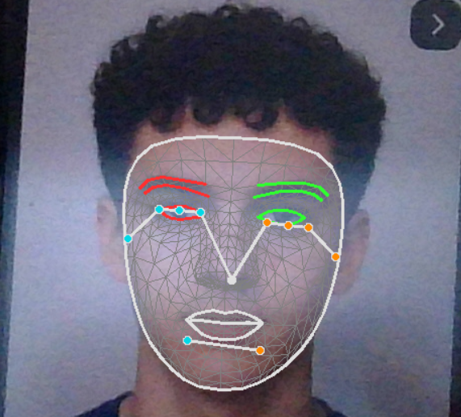

# AI Face, Hand & Pose Detection

A real-time computer vision application utilizing **MediaPipe** and **OpenCV** to perform simultaneous Face Mesh, Hand Tracking, and Pose Estimation. This project demonstrates the capability of modern AI models to track human landmarks efficiently on a standard CPU.

## 🚀 Features

- **Real-time Face Mesh**: Detects 468 face landmarks with refinement for irises.
- **Hand Tracking**: Tracks 21 3D landmarks per hand (multi-hand support).
- **Pose Estimation**: Detects 33 full-body pose landmarks.
- **FPS Display**: Monitors real-time performance.
- **Clean Visualization**: High-quality drawing utilities for all landmarks.

## 💡 Use Cases

- **Gesture Control**: Create touchless interfaces for computers or IoT devices.
- **Fitness & Sports Analysis**: Analyze posture and movement form in real-time.
- **Augmented Reality (AR)**: Apply face filters or virtual accessories.
- **Sign Language Recognition**: Build systems to interpret hand signs.
- **Driver Monitoring**: Detect fatigue or distraction based on head pose and eye state.

## 🛠️ Technologies Used

- **Python 3.8+**
- **OpenCV**: For video capture and image processing.
- **MediaPipe**: Google's open-source framework for cross-platform ML solutions.
- **NumPy**: For numerical operations.

## 📦 Installation

1. **Clone the repository** (if applicable) or download the source code.
2. **Install dependencies**:
   ```bash
   pip install -r requirements.txt
   ```

## ▶️ How to Run

Navigate to the project root directory and execute the main script:

```bash
python src/main.py
```

- **Press 'q'** to exit the application.

## 📷 Demo

> *Watch the full demo videos in the `assets/` folder.*



### Face & Hand Tracking
[Click here to watch Demo 1](assets/demo_1.mp4)

### Pose Estimation
[Click here to watch Demo 2](assets/demo_2.mp4)

Upon running the application, your default webcam will open. You should see:
- A mesh overlay on your face.
- Skeleton lines connecting joints on your hands.
- A stick-figure representation of your body pose.
- The current Frames Per Second (FPS) in the top-left corner.

The application is optimized to run smoothly on most modern laptops without requiring a dedicated GPU.

## 📂 Project Structure

```
AI Face Gesture Detection/
├── src/
│   ├── __init__.py
│   ├── main.py          # Entry point of the application
│   ├── detectors.py     # Wrapper class for MediaPipe solutions
│   └── utils.py         # Helper utilities (FPS counter)
├── requirements.txt     # Python dependencies
└── README.md            # Project documentation
```

## 🤝 Contributing

Feel free to fork this project and submit pull requests. You can extend this by adding gesture recognition, posture correction analysis, or integrating with other applications.

## 📄 License

This project is open-source and available for educational purposes.
